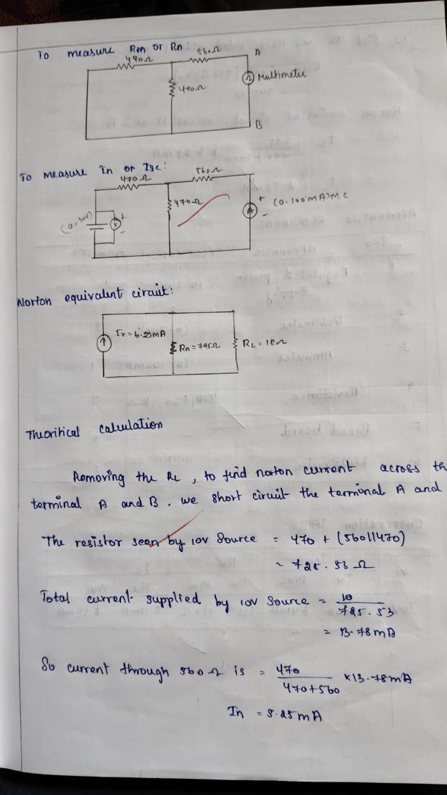
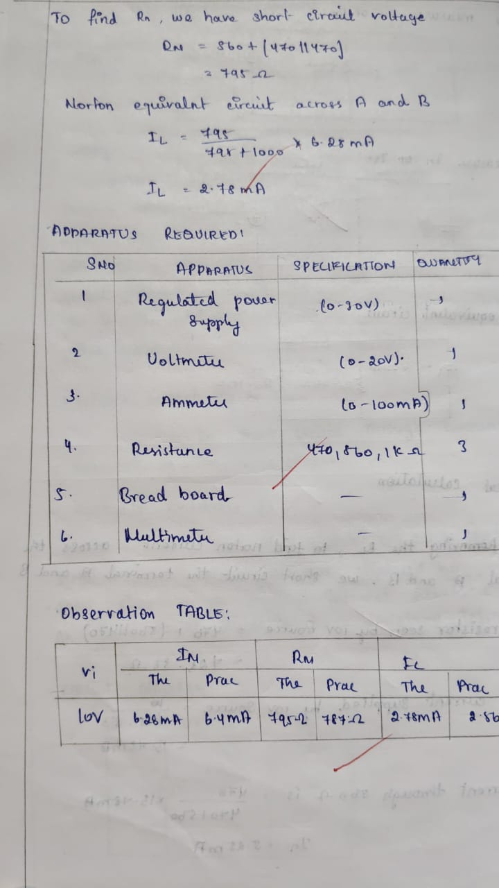
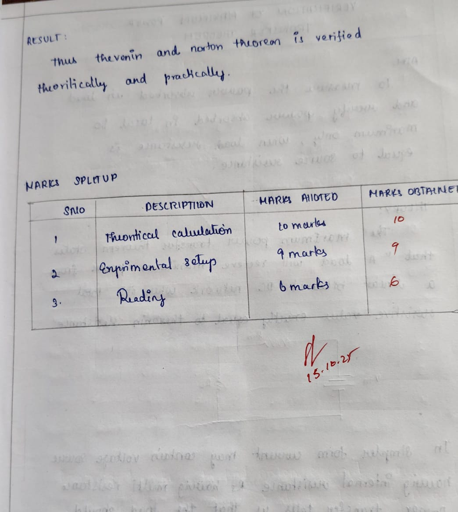

# 5.VERIFICATION-OF-NORTON-S-THEOREM

**AIM:**

To verify Norton’s theorem practically and theoretically for the given DC circuit.

**APPARATUS REQUIRED:**

1.	Regulated Power supply ( RPS)	(0-30 V)	1
2.	Voltmeter	(0-30 V) MC	1
3.	Ammeter	( 0 - 10 mA) MC	1
4.	Resistors	470 Ω 560 Ω 1 K Ω	2 1 1
5.	Bread board	---	1
6.	Multimeter	---	1

**THEORY:**

**NORTON’S THEOREM:**

Norton’s theorem states that, ‘a linear two-terminal circuit can be replaced by an equivalent circuit consisting of a current source, IN (=Isc) in parallel with a resistor RN (= RTh), where IN (=Isc) is the short-circuit current through the load terminals and RN is the equivalent resistance at the load terminals when the independent sources are turned off.Norton’s Current, IN or Isc:
It is the short-circuit current through the load terminals. i.e., IN = Isc

Norton’s Resistance, RN:It is the look-back resistance across the load terminals when all the sources are replaced by their internal resistances. An ideal voltage source is replaced by short- circuiting as its internal resistance is zero. An ideal current source is replaced by open- circuiting as its internal resistance is infinity.
 
**CIRCUIT DIAGRAM: VERIFICATION OF NORTON’S THEOREM**

**PROCEDURE:**

1.	Make the connections as per the Circuit Diagram:1

2.	Vary the RPS and set an input voltage of 10V.

3.	Note down the voltmeter reading (Vi) and ammeter reading (IL) in Tabular Column 1.

4.	Switch off the supply and make connections for Circuit Diagram 2.

5.	Measure the Thevenin’s resistance RTh= Norton’s resistance RN .

6.	Switch off the supply and make connections for Circuit Diagram:3.

7.	Set an input voltage of 10V in the RPS and note down the voltmeter readings Vi and VTh(=Voc) in Tabular Column:3

8.	Switch off the supply and make connections for Circuit Diagram 4.

9.	Set an input voltage of 10V in the RPS and note down the voltmeter reading Vi and Ammeter reading IN (= Isc) in Tabular Column 4.

10.	Draw the Thevenin’s equivalent circuit and Nortons’s equivalent circuit as shown in circuit diagrams 5 & 6 respectively.

11.	Calculate the IL value using the formula

   	Thevenin’s Theorem IL = VTh/ ( RTh+ R L)

   	Norton’s Theorem IL = IN * RN / ( RN + RL )

12.	Theoretically verify the Norton’s theorem.

**TABULAR COLUMN: 1**
To measure I L

Vi (volts)	IL (amps)

**TABULAR COLUMN:2**

To measure RTh or RN

Vi (volts)	RTh (Ω)

**TABULAR COLUMN:3**

To measure IN or Isc

Vi (volts)	IN (amps)
	
**MODEL CALCULATION:**

Practical value of IL (from tabulation 1) =2.3mA

**Verification of Norton’s theorem**

IL = IN * RN / ( RN+ RL ) = 2.43mA

Theoretical calculation of IL ,IN and RTh(RN) for the given circuit:
 

**RESULT:**

Thus Thevenin’s and Norton’s theorem is verified practically and theoretically.
